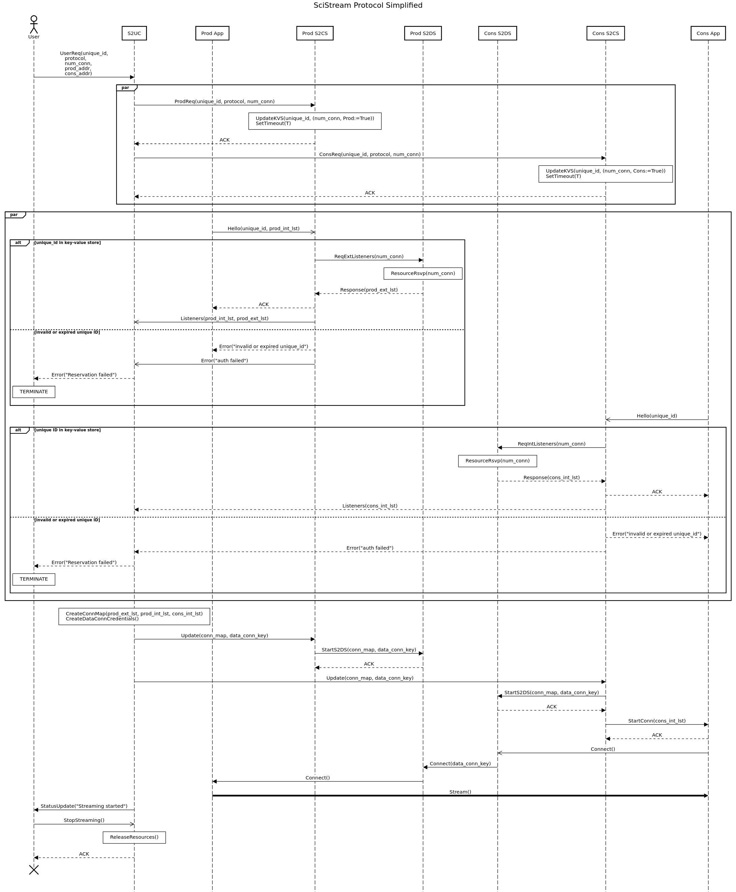

# SciStream Control Protocol
The SciStream protocol attempts to tackle the problem of enabling high-speed,
memory-to-memory data streaming in scientific environments.
This task is particularly challenging because data producers
(e.g., data acquisition applications on scientific instruments, simulations on supercomputers)
and consumers (e.g., data analysis applications) may be in different security domains
(and thus require bridging of those domains).
Furthermore, either producers, consumers, or both may lack external network connectivity (and thus require traffic forwarding proxies).
If you want to learn more, please take a look at our [HPDC'22 paper](https://dl.acm.org/doi/abs/10.1145/3502181.3531475).

## Pre-requisites
Ensure you have Python 3.9+ and [poetry](https://python-poetry.org/docs/) installed in your environment.

## Quick Start Development Environment
This may depends on the SciStream project, so the first step is to compile the SciStream Data Server (S2DS) submodule.

~~~
git submodule init
git submodule update
cd scistream/S2DS
make
cd ../../
~~~

Install dependencies using the following commands:
~~~
poetry install
poetry shell
#python S2CS/s2cs-new.py start --port=5000 --listener-ip=127.0.0.1
#python S2CS/s2cs-new.py start --port=6000 --listener-ip=127.0.0.1
#python S2CS/s2uc-new.py request
~~~~

The output of the test should look like this:

## Testing

~~~
poetry run pytest
~~~

## Specification

### Service
The protocol should enable high-speed, memory-to-memory data streaming in scientific environments
by establishing streaming data channels between two remote facilities using our reference architecture:

Buffer-and-forward elements are run at the Science DMZ to create bridges between the Ethernet-based WAN and HPC interconnets where data producers/consumers may reside.

### Software components
* **SciStream Data Server (S2DS):** software that runs on gateway nodes. It acts as a buffer-and-forward agent.
* **SciStream User Client (S2UC):** software that the end user and/or workflow engines/tools acting on behalf of the user interact with and provide relevant information (e.g., ID of a HPC job, ID of an experiment or data acquisition job on a scientific instrument, shared secret for secure communication with the user job (application) at the producer and consumer) to orchestrate end-to-end data streaming.
* **SciStream Control Server (S2CS):** a software running on one of the gateway nodes. It interacts with S2UC, data producer/consumer and S2DS.

### Environment
* S2UC communicates with producer/consumer S2CS over a private LAN/WAN or the Internet
* S2CS and S2DS communicate over a LAN
* Messages can be lost or corrupted

### Vocabulary of Messages
* **Requests:** { REQ, ReqListeners }
* **Responses:** { RESP, ProdLstn }
* **Commands:** { StartLstn, Hello, UpdateTargets, StartConn, Connect, REL }

### Message Format
* REQ (String unique_id, uint_32 num_conn, float rate, [String role])
* REL (String unique_id)
* RESP (String unique_id, String msg, [Array[num_conn] tuple(String ip_addr, uint32 port)])
* Hello (String unique_id, [Array[num_conn] tuple(String ip_addr, uint32 port)])
* ProdLstn (String unique_id, Array[num_conn] tuple(String ip_addr, uint32 port))
* UpdateTargets (Dict ConnectionMap, String data_conn_key)
* ERROR (String unique_id, String msg)

### Procedure Rules (Informal)
0. The user selects producer and consumer facilities, and authenticates with them via S2UC.
1. S2UC establishes an authenticated connection to (both producer and consumer) S2CS, and sends the “user request” (REQ) for the streaming job (which contains unique-id, protocol, number of connections, streaming rate, producer address and consumer address)
2. S2CS requests num_conn ports from S2DS, whom reserves num_conn ports on gateway nodes depending on availability
3. Both producer and consumer S2CS send connection information (i.e., IP addresses and ports) for data connections to S2UC
4. When ProdApp starts, it connects to producer S2CS and presents the “unique-id” and set of port listeners
5. Prod S2CS forwards set of port listeners to S2UC
6. S2UC creates connection map and data connection credentials, and sends them to both producer and consumer S2CS
7. Both producer and consumer S2DS create bridges between Prod/Cons App and the WAN (i.e., start buffer-and-forward elements)
8. ConsApp establishes num_conn data streaming channels
9. Both S2DS use data connection credentials to establish external (WAN) streaming channel
10. ProdApp starts streaming task

### Collaboration Diagram

### Sequence Diagram

