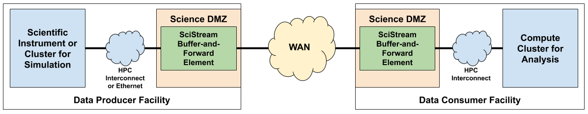

# SciStream Control Protocol
The SciStream protocol attempts to tackle the problem of enabling high-speed,
memory-to-memory data streaming in scientific environments.
This task is particularly challenging because data producers
(e.g., data acquisition applications on scientific instruments, simulations on supercomputers)
and consumers (e.g., data analysis applications) may be in different security domains
(and thus require bridging of those domains).
Furthermore, either producers, consumers, or both may lack external network connectivity (and thus require traffic forwarding proxies).
If you want to learn more, please take a look at our [HPDC'22 paper](https://dl.acm.org/doi/abs/10.1145/3502181.3531475).

## Pre-requisites
We use [poetry](https://python-poetry.org/docs/) to manage our python environments. Please ensure you have Python 3.9+ and poetry installed in your environment.

We also use a Git submodules to manage dependencies, such as the SciStream project. To set up the SciStream Data Server (S2DS) submodule, run the following commands:

~~~
git submodule init
git submodule update
cd scistream/S2DS
make
cd ../../
~~~

This process initializes, updates, and compiles the submodule, streamlining your project setup and ensuring compatibility with the latest version of the parent project.

## Quick Start

The following commands download and installs all the necessary python dependencies. It also activates the virtual environment.

~~~
poetry install
poetry shell
~~~~

The easiest way to verify if the code works is to run pytest:

~~~
poetry run pytest
~~~

The output of the test should look like this:

~~~
========================================== test session starts ==========================================
platform linux -- Python 3.9.16, pytest-7.2.2, pluggy-1.0.0
rootdir: /home/fcastro/dev/scistream-proto
plugins: timeout-2.1.0
collected 6 items                                                                                       

tests/test_s2cs.py .x....                                                                         [100%]

===================================== 5 passed, 1 xfailed in 5.81s ======================================
~~~

## Tutorial

### Authentication

We integrated with globus platform for the purpose of authentication.

If your token expired you might want to start by logging out.
~~~
$ python src/s2uc.py logout
~~~

After that let's log in:

~~~
$ python src/s2uc.py login
~~~

You will see a URL. You need to open the url provided in a web browser, log in with the proper credentials, then copy and paste the authorization code into the cli prompt.

~~~
(scistream-proto-py3.9) bash-3.2$ python src/s2uc.py login
Please authenticate with Globus here:
------------------------------------
https://auth.globus.org/v2/oauth2/authorize?client_id=4787c84e-9c55-a11c&redirect_uri=https%3A%2F%2Fauth.globus.org=login
------------------------------------

Enter the resulting Authorization Code here:
~~~

After logging in you can move to the next tutorial step.

### Running scistream

To understand the behavior of the code let's simulate the environment by opening 3 terminals, 1 for the s2cs Producer, 1 for s2cs Consumer, and one for the client terminal.

To run this you will need to open multiple terminals:

~~~
python src/s2cs.py start --port=5000 --listener-ip=127.0.0.1
python src/s2uc.py request1
~~~

Several things will happen in the background to learn more please review the code. The output of the client should look like this:

~~~
listeners: "0.0.0.0:43579"
listeners: "0.0.0.0:34375"
listeners: "0.0.0.0:34343"
listeners: "0.0.0.0:38223"
listeners: "0.0.0.0:34865"
prod_listeners: "127.0.0.1:7000"
prod_listeners: "127.0.0.1:17000"
prod_listeners: "127.0.0.1:27000"
prod_listeners: "127.0.0.1:37000"
prod_listeners: "127.0.0.1:47000"

Sending updated connection map information...
82f0e9b8-eb7d-11ed-be3c-f303ca66dd31
~~~
In this case 82f0e9b8-eb7d-11ed-be3c-f303ca66dd31 is the uid, let's use that to send a release:
~~~
$ python src/s2uc.py release 82f0e9b8-eb7d-11ed-be3c-f303ca66dd31
Release completed
~~~
## Troubleshooting Guide

The first step of troubleshooting is restarting everything with the --verbose flag:
~~~
python src/s2cs.py start --port=5000 --listener-ip=127.0.0.1 --verbose
~~~

This should output more info, if you continue facing issues please create an issue on github.

## FAQ

Make sure that you start the poetry environment with the correct python version

## Specification

### Service
The protocol should enable high-speed, memory-to-memory data streaming in scientific environments
by establishing streaming data channels between two remote facilities using our reference architecture:

Buffer-and-forward elements are run at the Science DMZ to create bridges between the Ethernet-based WAN and HPC interconnets where data producers/consumers may reside.

### Software components
* **SciStream Data Server (S2DS):** software that runs on gateway nodes. It acts as a buffer-and-forward agent.
* **SciStream User Client (S2UC):** software that the end user and/or workflow engines/tools acting on behalf of the user interact with and provide relevant information (e.g., ID of a HPC job, ID of an experiment or data acquisition job on a scientific instrument, shared secret for secure communication with the user job (application) at the producer and consumer) to orchestrate end-to-end data streaming.
* **SciStream Control Server (S2CS):** a software running on one of the gateway nodes. It interacts with S2UC, data producer/consumer and S2DS.

### Environment
* S2UC communicates with producer/consumer S2CS over a private LAN/WAN or the Internet
* S2CS and S2DS communicate over a LAN
* Messages can be lost or corrupted

### Vocabulary of Messages
* **Requests:** { REQ, ReqListeners }
* **Responses:** { RESP, ProdLstn }
* **Commands:** { StartLstn, Hello, UpdateTargets, StartConn, Connect, REL }

### Procedure Rules (Informal)
0. The user selects producer and consumer facilities, and authenticates with them via S2UC.
1. S2UC establishes an authenticated connection to (both producer and consumer) S2CS, and sends the “user request” (REQ) for the streaming job (which contains unique-id, protocol, number of connections, streaming rate, producer address and consumer address)
2. S2CS requests num_conn ports from S2DS, whom reserves num_conn ports on gateway nodes depending on availability
3. Both producer and consumer S2CS send connection information (i.e., IP addresses and ports) for data connections to S2UC
4. When ProdApp starts, it connects to producer S2CS and presents the “unique-id” and set of port listeners
5. Prod S2CS forwards set of port listeners to S2UC
6. S2UC creates connection map and data connection credentials, and sends them to both producer and consumer S2CS
7. Both producer and consumer S2DS create bridges between Prod/Cons App and the WAN (i.e., start buffer-and-forward elements)
8. ConsApp establishes num_conn data streaming channels
9. Both S2DS use data connection credentials to establish external (WAN) streaming channel
10. ProdApp starts streaming task

### Collaboration Diagram

### Sequence Diagram

