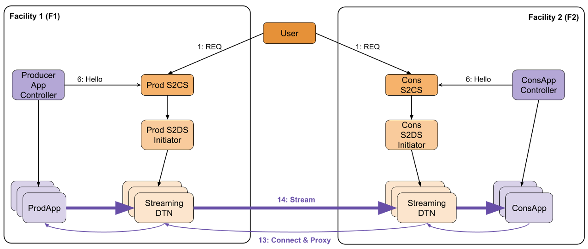

# 8. SciStream Tutorials

This guide provides practical tutorials for working with SciStream, a secure tunneling solution for scientific data transfer.

## 8.1 What is SciStream?

SciStream creates encrypted connections between endpoints, allowing data to flow securely between them, even across network boundaries. It's designed specifically for scientific data transfer needs, providing both security and performance.

## 8.2 Terminology Guide

Before diving into tutorials, it's important to understand key SciStream terminology:

- **INBOUND proxy (PROD)**: Sets up the receiving end of the tunnel (server side)
- **OUTBOUND proxy (CONS)**: Sets up the sending end of the tunnel (client side)
- **Listeners**: Ports that accept incoming connections
- **Remote listeners**: The remote destination ports that receive the forwarded connections

## 8.3 Understanding Data Flow



1. Your client application connects to the local port on the client machine
2. The SciStream outbound request forwards this connection through the secure tunnel
3. The SciStream inbound request receives the forwarded connection
4. Data is delivered to your server application listening on the receiver port

## 8.4 Tutorial Environment

This tutorial uses a Vagrant-based virtual environment for demonstration purposes. For production environments, you would deploy SciStream directly on your infrastructure.

### 8.4.1 Prerequisites

- Vagrant installed
- VirtualBox or similar virtualization software
- Basic familiarity with command-line operations

### 8.4.2 Setting Up the Vagrant Environment

A reference Vagrant file is provided in the root directory:

```bash
vagrant up
```

This creates several virtual machines that simulate a distributed environment.

## 8.5 SSL/TLS Configuration

Generate certificates for secure communication:

```bash
vagrant ssh producers2
openssl genrsa -out server.key 2048
```

Create a server.conf file:
```
[req]
distinguished_name = req_distinguished_name
x509_extensions = v3_req
prompt = no

[req_distinguished_name]
CN = 192.168.30.10

[v3_req]
subjectAltName = IP:192.168.30.10
```

Generate the certificates:
```bash
openssl req -new -key server.key -out server.csr -config server.conf
openssl x509 -req -days 365 -in server.csr -signkey server.key -out server.crt -extfile server.conf -extensions v3_req
```

## 8.6 Creating a Secure Tunnel

### 8.6.1 Step 1: Set Up the Inbound Request (Server Side)

Start the control server on the server side:

```bash
vagrant ssh producers2
s2cs --verbose --port=5007 --listener-ip=192.168.10.11 --type=Haproxy
```

Initialize the inbound request:

```bash
vagrant ssh producer
cp ./vagrant/server.crt ./server.crt
s2uc inbound_request --s2cs 192.168.10.11:5007 --remote_ip 192.168.10.10 --receiver_ports 5001 --mock True
```

You'll see output similar to:
```
uid; s2cs; access_token; role
4f8583bc-a4d3-11ee-9fd6-034d1fcbd7c3 192.168.10.11:5007 INVALID_TOKEN PROD
sending client request message
waiting for hello message
sending for hello message
Hello message sent successfully
Listeners: ['192.168.10.11:5100']
```

**Important**: Note the UID and listener information from the output. You'll need these for the outbound request.

### 8.6.2 Step 2: Set Up the Outbound Request (Client Side)

Start the control server on the client side:

```bash
vagrant ssh consumers2
s2cs --verbose --port=5007 --listener-ip=192.168.30.10 --type=Haproxy --client-id "abc" --client-secret "xyz"
```

Initialize the outbound request using the UID and listener from step 1:

```bash
vagrant ssh consumer
cp ./vagrant/server.crt ./server.crt
s2uc login --scope "abc"
s2uc outbound_request --s2cs 192.168.30.10:5007 --remote_ip 192.168.20.10 --receiver_ports 5100 4f8583bc-a4d3-11ee-9fd6-034d1fcbd7c3 192.168.10.11:5100
```

## 8.7 Testing the Tunnel

### 8.7.1 Start Server Application

On the server side (producer):

```bash
vagrant ssh producer
iperf -s -p 5001
```

### 8.7.2 Start Client Application

On the client side (consumer):

```bash
iperf -c 192.168.20.10 -p 5100 -t 60
```

This initiates a 60-second data stream through the tunnel. Data sent to port 5100 on the client side will be securely transmitted to port 5001 on the server side.

### 8.7.3 Verification

After setting up both sides of the tunnel, verify that the connection works properly:

```bash
# Check listening ports
ss -tlpn
```

### 8.7.4 Release Resources

When finished, release the allocated resources:

```bash
s2uc release 4f8583bc-a4d3-11ee-9fd6-034d1fcbd7c3 --s2cs 192.168.10.11:5007
```

## 8.8 Container-Based Deployment

For production environments, you can use container-based deployment:

```bash
podman run --rm --net=host -v ./server1:/scistream --entrypoint=s2uc castroflaviojr/scistream:1.2.1 inbound-request --remote_ip 192.168.150.1 --s2cs 192.168.150.1:5000 --receiver_ports 5300 --server_cert=/scistream/server.crt
```

## 8.9 Advanced Topics

### 8.9.1 Implementation Types

SciStream supports multiple data server implementations:

- Haproxy
- Nginx
- Stunnel
- StunnelSubprocess
- HaproxySubprocess

Specify the implementation type when starting S2CS:

```bash
s2cs --type=Haproxy
```

### 8.9.2 Port Range Management

Configure port ranges for data transfer:

```bash
s2cs --port-range=10000-20000
```

This restricts SciStream to using ports in the specified range for data forwarding.

## 8.10 Troubleshooting

### 8.10.1 Common Issues

1. **Connection Refused Error**
   - Check that the s2cs control server is running on both machines
   - Verify that the specified ports are not blocked by firewalls

2. **Certificate Issues**
   - Ensure you're using the correct certificate for each machine
   - Check certificate permissions and paths

3. **UID Mismatch**
   - Double-check that you've correctly copied the UID from the inbound request

4. **Network Configuration**
   - Verify that both machines can reach each other on the specified ports
   - Check for any NAT or routing issues that might affect connectivity

### 8.10.2 Diagnostic Commands

```bash
# Check for running SciStream processes
ps aux | grep s2

# Check TLS certificate validity
openssl x509 -in server.crt -text -noout
```

## 8.11 Quick Reference

| Action | Command Template |
|--------|------------------|
| Start Inbound Request | `s2uc inbound_request --remote_ip <server_ip> --s2cs <server_ip>:5000 --receiver_ports <app_port> --server_cert=<cert_path>` |
| Start Outbound Request | `s2uc outbound_request --remote_ip <client_ip> --s2cs <client_ip>:5000 --receiver_ports <local_port> --server_cert=<cert_path> <uid> <listener>` |
| Close Connection | `s2uc release <uid>` |
| Check Connections | `ss -tlpn` |