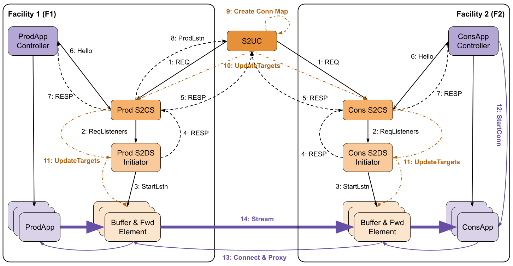
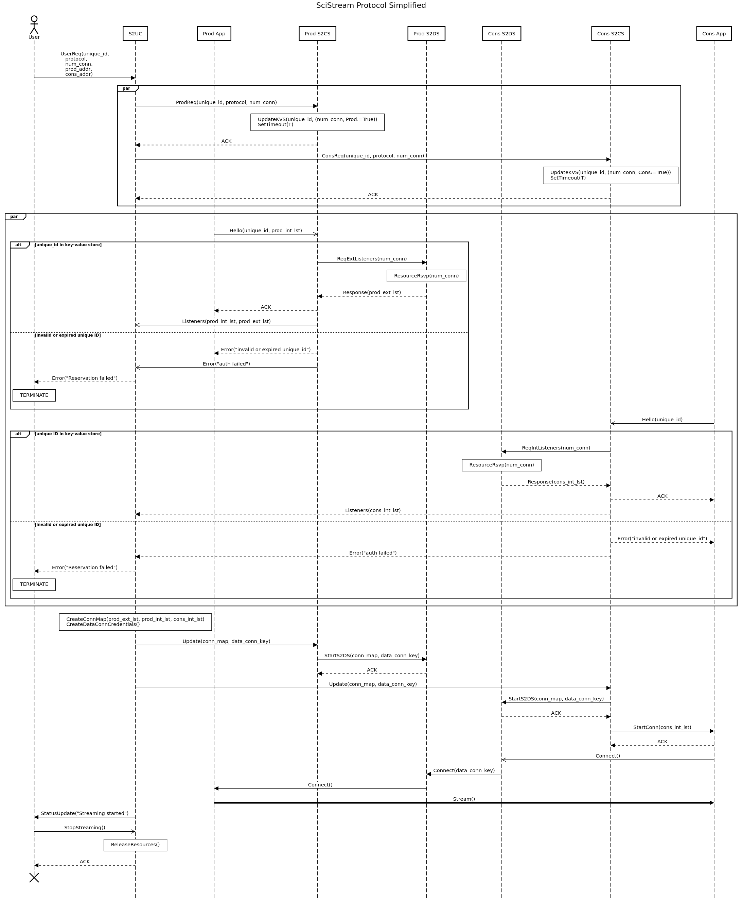

# Scistream Documentation

Welcome to the Scistream Documentation. As in the case with any on-going project, these docs may fall out of sync with the project, but we’ll try our best to keep them accurate.

Scistream is a framework and toolkit that attempts to tackle the problem of enabling high-speed(+100Gbps), memory-to-memory data streaming in scientific environments. This task is particularly challenging because data producers (e.g., data acquisition applications on scientific instruments, simulations on supercomputers) and consumers (e.g., data analysis applications) may be in different institutions (security domains) and thus require bridging of those domains. Furthermore, either producers, consumers, or both may lack external network connectivity and thus require traffic forwarding proxies.

If you want to learn more about Scistream, please check the ["What is Scistream" page](scistream/README.md). For further detail review our papers: [HPDC'22](https://dl.acm.org/doi/abs/10.1145/3502181.3531475) and [INDIS'22](https://ieeexplore.ieee.org/document/10024674).

## Documentation

   - [What is Scistream?](scistream/README.md)
   - [Getting started](quickstart.md)
   - [User Guide](guides/user.md)
   - [Developer Guide](guides/dev.md)

## Project layout

    poetry.lock         # Explicitly documents all Python dependencies using Poetry
    pyproject.toml      # Python dependencie: Poetry equivalent to requirements.txt
    mkdocs.yml          # Documentation configuration file.
    docs/
      index.md          # The documentation homepage.
      ...               # Other markdown pages, images and other files.
    deploy/
      setup.sh          # Installation script
    src/
      proto/            # GRPC protocol specifications
      appcontroller.py  # Application controller reference implementations
      s2cs.py           # Scistream Control Server implementation
      s2ds.py           # Scistream Dataplane server plugin
      s2uc.py           # Scistream User Client implementation
      utils.py          # Supporting code
      ...               # other files
    tests/
      test_s2cs.py      # pytest tests
      ...               # other tests

### Environment
      * S2UC communicates with producer/consumer S2CS over a private LAN/WAN or the Internet
      * S2CS and S2DS communicate over a LAN
      * Messages can be lost or corrupted

### Vocabulary of Messages
      * **Requests:** { REQ, ReqListeners }
      * **Responses:** { RESP, ProdLstn }
      * **Commands:** { StartLstn, Hello, UpdateTargets, StartConn, Connect, REL }

### Procedure Rules (Informal)
      0. The user selects producer and consumer facilities, and authenticates with them via S2UC.
      1. S2UC establishes an authenticated connection to (both producer and consumer) S2CS, and sends the “user request” (REQ) for the streaming job (which contains unique-id, protocol, number of connections, streaming rate, producer address and consumer address)
      2. S2CS requests num_conn ports from S2DS, whom reserves num_conn ports on gateway nodes depending on availability
      3. Both producer and consumer S2CS send connection information (i.e., IP addresses and ports) for data connections to S2UC
      4. When ProdApp starts, it connects to producer S2CS and presents the “unique-id” and set of port listeners
      5. Prod S2CS forwards set of port listeners to S2UC
      6. S2UC creates connection map and data connection credentials, and sends them to both producer and consumer S2CS
      7. Both producer and consumer S2DS create bridges between Prod/Cons App and the WAN (i.e., start buffer-and-forward elements)
      8. ConsApp establishes num_conn data streaming channels
      9. Both S2DS use data connection credentials to establish external (WAN) streaming channel
      10. ProdApp starts streaming task

### Collaboration Diagram

### Sequence Diagram

