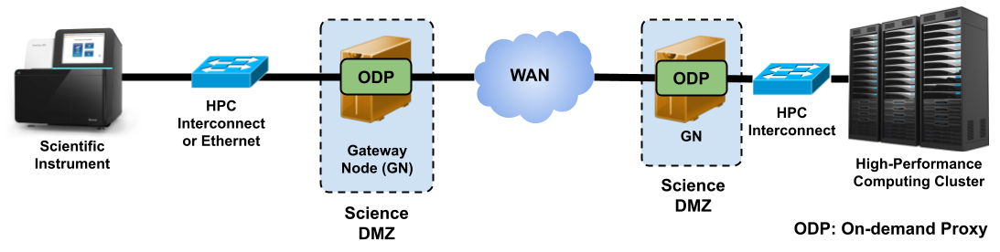

# 1. Introduction to Scistream

Welcome to the Scistream Documentation. This guide is designed to help you understand, set up, and effectively use Scistream for your data streaming needs. As with any ongoing project, this documentation may fall out of sync with the latest developments, but we will make every effort to keep it as accurate and up-to-date as possible.

## 1.1 What is Scistream?

Scistream is a framework and toolkit that aims to solve the problem of enabling high-speed (100Gbps+), memory-to-memory data streaming between scientific instruments and remote computing facilities. It addresses the challenges of streaming data in scientific environments where data producers (e.g., scientific instruments) and consumers (e.g., analysis applications) are often located in different institutions with distinct security domains.

Scistream tackles these challenges by providing a middlebox-based architecture with control protocols that establish authenticated and transparent connections between the data producer and consumer while efficiently bridging the different security domains. It integrates with existing authentication and authorization systems, such as Globus Auth, to ensure secure communication between the participating facilities.

## 1.2 Key Features

- High-speed memory-to-memory data streaming (100Gbps+)
- Bridging of security domains between scientific instruments and remote computing facilities
- Integration with existing authentication and authorization systems (e.g., Globus Auth)
- Transparent and efficient connections between data producers and consumers
- Agnostic to data streaming libraries and applications

For a more detailed explanation of the Scistream protocol and components, please refer to "Understanding Scistream". For further details, you can also review our papers: [HPDC'22](https://dl.acm.org/doi/abs/10.1145/3502181.3531475) and [INDIS'22](https://ieeexplore.ieee.org/document/10024674).

## 1.3 Motivation

Many modern scientific workflows require real-time data analysis, reduction, feature detection, and experiment steering. However, achieving efficient and secure data streaming in practice is challenging due to the lack of direct external network connectivity for scientific instruments and the authentication and security requirements of high-performance computing (HPC) centers.

For example, Scistream can enable real-time data analysis for synchrotron light source experiments, where the detector generates data at high rates, and the analysis needs to be performed on a remote high-performance computing (HPC) cluster. Similarly, in cosmology simulations, Scistream can facilitate streaming of simulation data to a remote facility for real-time visualization and analysis.

## 1.4 Scistream Architecture Overview

Participating scientific facilities, typically in independent administrative domains, make their computing resources available through programmatic interfaces to enable wide-area streaming analysis. The Scistream architecture relies on gateway nodes (GNs) and control protocols to create on-demand proxies between an instrument's LAN and the WAN, as shown in Figure 1.1.

Scistream's use of proxies at the transport layer ensures that the architecture is agnostic to streaming application libraries and implementations.

In the next [chapter](scistream.md), we will dive deeper into the Scistream protocol, software components, and their roles in enabling high-speed, secure data streaming between scientific instruments and remote computing facilities.
