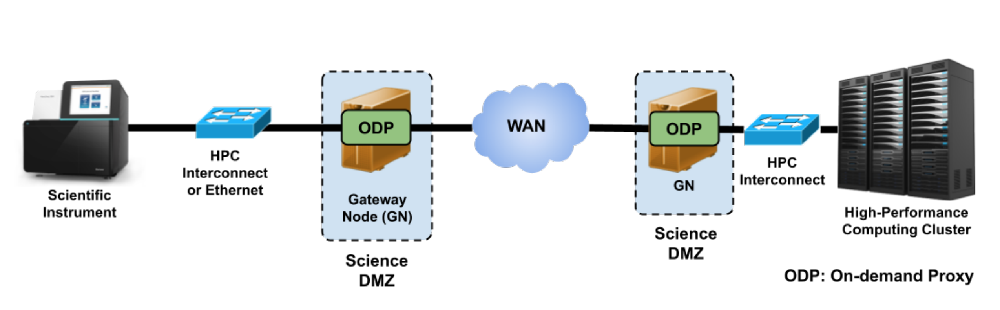
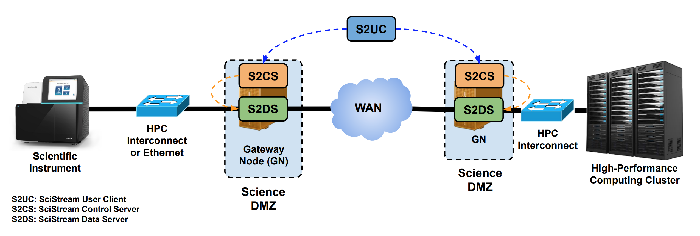
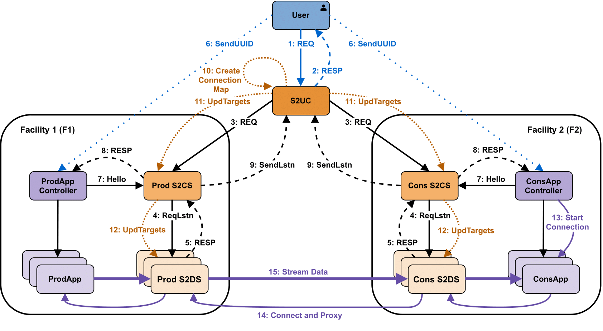

# What is Scistream?

SciStream system in which participating scientific facilities (typically in independent administrative domains) make their computing resources available through programmatic interfaces to enable wide-area streaming analysis. The SciStream architecture relies on gateway nodes (GNs) and control protocols to create on-demand proxies between an instrument’s LAN and the WAN as shown in Figure 1a.

SciStream’s use of proxies at the transport layer ensures that the architecture is agnostic of streaming application libraries and implementations.

### Motivation

Many modern scientific workflows require real-time data analysis, reduction, feature detection, and experiment steering. However, achieving efficient and secure data streaming in practice is challenging due to the lack of direct external network connectivity for scientific instruments and the authentication and security requirements of high-performance computing (HPC) centers.

## How SciStream Works

1. The user authenticates with the participating facilities and requests a streaming job through the SciStream User Client (S2UC).
2. The SciStream Control Servers (S2CS) at the producer and consumer facilities negotiate the connection details and allocate the necessary resources.
3. The SciStream Data Servers (S2DS) establish authenticated and transparent connections between the data producer and consumer.
4. The data producer streams data to the consumer through the SciStream infrastructure, enabling real-time analysis and visualization.

### Software components

SciStream has three software components that participate in the control protocols (see Figure 1b):

* SciStream Data Server (S2DS)
* SciStream User Client (S2UC)
* SciStream Control Server (S2CS)

#### SciStream Data Server (S2DS)

Software that runs on gateway nodes. It forwards the data from one facility to another. Currently we have 3 implementations, 1 was developed by us and 2 of them are open-source commercial grade proxies: Nginx and Haproxy.

In our previous studies, we have rigorously quantified the overhead associated with prior implementations. Currently, we are in the process of compiling a comprehensive dataset to accurately assess the overhead of our latest implementation

#### SciStream User Client (S2UC)
 Software the end user and/or workflow engines/tools acting on behalf of the user interact with and provide relevant information to orchestrate end-to-end data streaming.

S2UC allows the user to fetch short-term proxy credentials through integration with federated identity management and certificate generation systems. As of our 1.0 release we support this through Globus Auth integration.

It authenticates (on behalf of the user) with S2CS on the GNs and orchestrates the creation of an end-to-end
data channel.

It also generates shared keys that the user must pass
to producer and consumer applications in order for the applications
to communicate with control elements of SciStream.

#### SciStream Control Server (S2CS)

Software running on the gateway nodes. It interacts with S2UC, Application controlers for data producer/consumer and S2DS. It authenticates the user and producer/consumer applications (using preshared keys). It manages gateway node resources and S2DS, including initiating, monitoring, and terminating S2DS
processes. As of release 1.0 we support this through Docker.

Allows authentication of user requests via Globus Auth integration. This is implemented using scopes, which of those is tied to an authentication entity.

## SciStream Control Protocol

The SciStream protocol was designed to establish authenticated and transparent end-to-end data streaming connections between a data producer application (ProdAPP) at Facility 1 and a data consumer application (ConsAPP) at Facility 2.

This process is facilitated by a centralized controller, S2UC, which interacts with both applications and their respective facility control servers (S2CS) to manage the streaming setup. The protocol ensures that the necessary resources are allocated, and the streaming paths are configured to enable data transfer between the producer and consumer applications.

Below we provide a summarized description of the protocol for complete detail please refer to our [HPDC'22 paper](https://dl.acm.org/doi/abs/10.1145/3502181.3531475).

##### Request Submission
The user initiates a connection by submitting a detailed request to S2UC, which includes connection information, required bandwidth, and authentication.
 Then S2UC and S2CS work together to check resource availability, reserve necessary resources, and allocate ports for data transmission.

##### Hello message
The user must provide the unique request ID to ProdAPP and ConsAPP controllers. This allows S2CS to authenticate the controllers and identify the specific request being set up.

The application controllers communicate with S2CS to provide connection details, and S2UC creates a connection map to define data movement paths based.

##### Request Release
To release a request, the user submits a new request to S2UC with the unique ID of the request to be terminated, leading to the release of resources and termination of S2DS instances.

Please proceed to our [tutorials](../quickstart.md)
