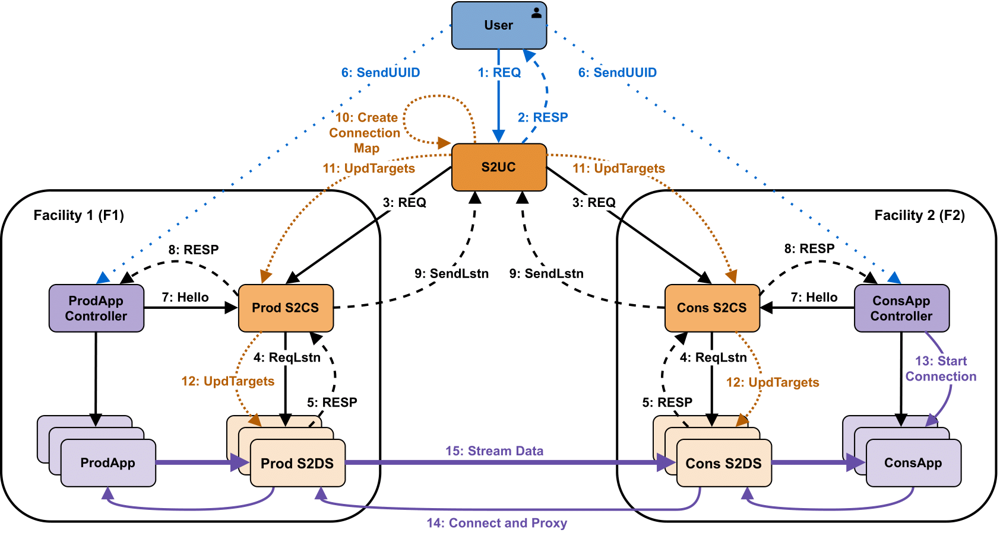
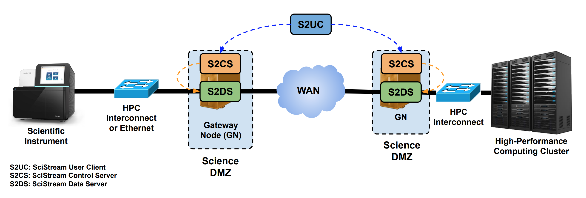

# 2. Understanding Scistream

In this page, we will delve into the details of the Scistream protocol, its software components, and their roles in enabling high-speed, secure data streaming between scientific instruments and remote computing facilities.

## 2.1 Scistream Protocol

The Scistream protocol is designed to establish authenticated and transparent end-to-end data streaming connections between a data producer application (ProdApp) at Facility 1 and a data consumer application (ConsApp) at Facility 2. This process is facilitated by a centralized controller, Scistream User Client (S2UC), which interacts with both applications and their respective facility control servers, Scistream Control Servers (S2CS), to manage the streaming setup. The protocol ensures that the necessary resources are allocated and the streaming paths are configured to enable data transfer between the producer and consumer applications.

### 2.1.1 Request Submission

The user initiates a connection by submitting a detailed request to S2UC, which includes connection information, required bandwidth, and authentication. Then, S2UC and S2CS work together to check resource availability, reserve necessary resources, and allocate ports for data transmission.

### 2.1.2 Hello Message

The user must provide the unique request ID to ProdApp and ConsApp controllers. This allows S2CS to authenticate the controllers and identify the specific request being set up. The application controllers communicate with S2CS to provide connection details, and S2UC creates a connection map to define data movement paths.

### 2.1.3 Request Release

To release a request, the user submits a new request to S2UC with the unique ID of the request to be terminated, leading to the release of resources and termination of Scistream Data Server (S2DS) instances.

## 2.2 Software Components

Scistream has three main software components that participate in the control and data flow:

1. Scistream Data Server (S2DS)
2. Scistream User Client (S2UC)
3. Scistream Control Server (S2CS)

### 2.2.1 Scistream Data Server (S2DS)

S2DS runs on gateway nodes and acts as a proxy between the internal network (LAN or HPC interconnect) and the external WAN. It forwards data from one facility to another. Currently, there are three implementations: one developed by the Scistream team and two open-source, commercial-grade proxies: Nginx and HAProxy.

### 2.2.2 Scistream User Client (S2UC)

S2UC is the software that end-users and/or workflow engines/tools interact with to provide relevant information and orchestrate end-to-end data streaming. It allows users to fetch short-term proxy credentials through integration with federated identity management and certificate generation systems, such as Globus Auth. S2UC authenticates (on behalf of the user) with S2CS on the gateway nodes and orchestrates the creation of an end-to-end data channel. It also generates shared keys that the user must pass to producer and consumer applications for them to communicate with the control elements of Scistream.

### 2.2.3 Scistream Control Server (S2CS)

S2CS runs on the gateway nodes and interacts with S2UC, application controllers for data producer/consumer, and S2DS. It authenticates the user and producer/consumer applications using pre-shared keys. S2CS manages gateway node resources and S2DS, including initiating, monitoring, and terminating S2DS processes. As of release 1.0, Scistream supports this through Docker.

In the next chapter, we will guide you through the process of setting up Scistream.
