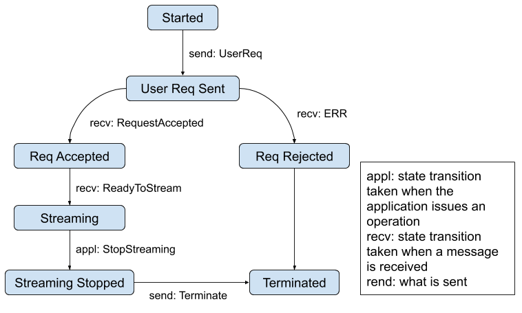
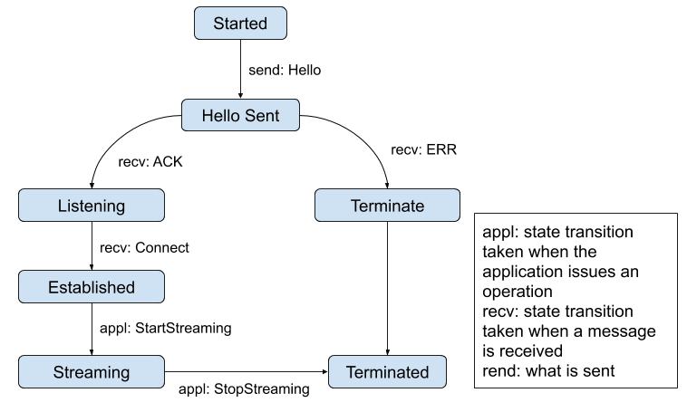
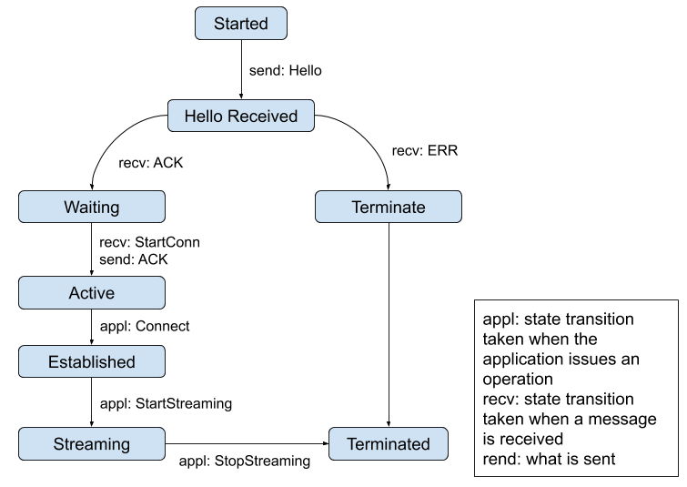

# Utils

This folder contains utilities and state machines for entities not part of SciStream protocol (i.e., user, ProdApp, and ConsApp), but still necessary for its well functioning.

## User State Machine

## ProdApp State Machine

## ConsApp State Machine

